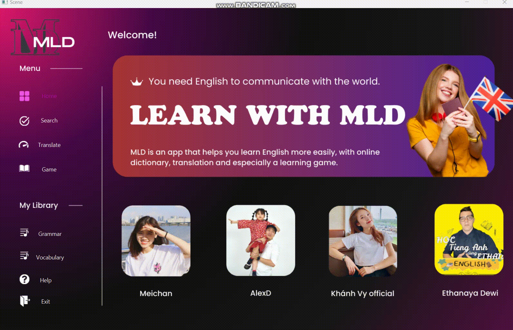

# MLDdictionary.oop
Project Từ điển offline và online. 

# Thông tin thành viên : 

1. Nguyễn Hà Linh - K67T-CLC - Khoa CNTT - UET
2. Phan Tiến Đạt - K67T-CLC - Khoa CNTT - UET
3. Trần Thị Hoa Mai - K67CA-CLC3 - Khoa CNTT - UET

# Cây thừa kế: 
- Cây chỉ có quan hệ has-a:
  .png)
- Cây có quan hệ has-a và is-a:
  

# Thông tin dự án : 

- Sử dụng Ngôn ngữ lập tình Java
- Sử dụng thư viện đồ họa JavaFX
- Sử dụng cơ sở dữ liệu SQLite
- Sử dụng google translate API để dịch đoạn văn và phát ra âm thanh.
- JSON simple 1.1.1 : đọc file JSON lấy từ web
- opencsv 5.5: đọc và ghi các tệp CSV trong Java.
- httpclient 4.5.13: tạo và thực hiện các yêu cầu HTTP trong Java.
- formsfx-core 11.6.0: các thành phần để xây dựng và quản lý các biểu mẫu trong ứng dụng JavaFX.
- junit-jupiter-api và junit-jupiter-engine:kiểm thử đơn vị cho Java.
- sqlite-jdbc 3.44.0.0: JDBC driver cho SQLite, giúp kết nối và tương tác với cơ sở dữ liệu SQLite từ Java.
- jlayer 1.0.1: giải mã và chơi âm thanh từ định dạng MP3.
- json-simple 1.1.1: xử lý và tạo JSON trong Java.
- json : xử lý JSON trong Java.

# Mô tả project: 
Dự án này cung cấp một loạt các tính năng hữu ích từ tra cứu từ điển, dịch ngôn ngữ, chơi game để học từ vựng, đến cung cấp kiến thức ngữ pháp và từ vựng. Ứng dụng cũng tích hợp các thư viện và công nghệ đa dạng để đảm bảo sự linh hoạt và tính ổn định.

# Cách sử dụng: 
- Update Maven and run DictionaryApplication.java in src/main/java/com/example/myjavafxapp

# Các tính năng:
- # Search: 

- Bạn hãy nhập từ muốn tra vào mục searchField và sau đó ấn nút Search!
  + *Chúng tôi đã tích hợp phần Speech(phát âm từ) ngay trong nút Search*
  + Chúng tôi đã tích hợp 3 tính năng Add, Delete, Change để cải tiến từ điển.
  + Đối với phần từ điển Anh - Việt, bạn hãy nhập đủ thông tin vào 3 ô wordTargetArea, wordSoundArea, wordExplainArea.
  + Đối với phần từ điển Anh - Anh, bạn hãy ấn Search khi searchField trống để hiện ra form cần nhập vào, sau đó hãy nhập theo form cho trước sau đó lựa chọn nút của bạn.
  
- # Translate:

  + Chúng tôi giúp bạn có thể dịch tự động từ bất kì ngôn ngữ nào ở trong phần inputTextArea.
  + Sau đó chọn ngôn ngữ kết quả mà bạn muốn dịch thành ở trong ChoiceBox và ấn nút Translate.
  + Kết quả sẽ được hiển thị ra ở resultTextArea, khi đó bạn chỉ cần ấn Speech và chúng tôi sẽ giúp bạn đọc toàn bộ văn bản.
- # Game: 

  + Chúng tôi có 50s đếm ngược, nhiệm vụ của bạn là hãy nhanh tay nhanh mắt đọc từ hiển thị trên màn hình và chọn nhanh 1 trong 4 đáp án để chọn ra đúng nghĩa của từ đã cho.
  + Mỗi lần trả lời đúng bạn sẽ được cộng 1 điểm.
  + Sau khi hoàn thành trò chơi tôi sẽ hiện ra điểm số của bạn và 1 bảng danh sách những câu bạn đã trả lời sai để bạn có thể học lại những từ đó 1 lần nữa.
- # Grammar: 

  + Chúng tôi cung cấp một số ngữ pháp tiếng anh quan trọng.
- # Vocabulary: 

  + Chúng tôi cung cấp một số từ vựng tiếng anh phổ biến nhất trong các lĩnh vực.
- # Help:
  + Hỗ trợ bạn các button để hướng dẫn sử dụng
    

